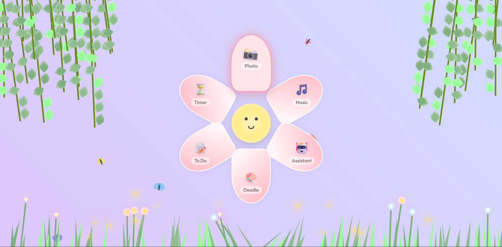
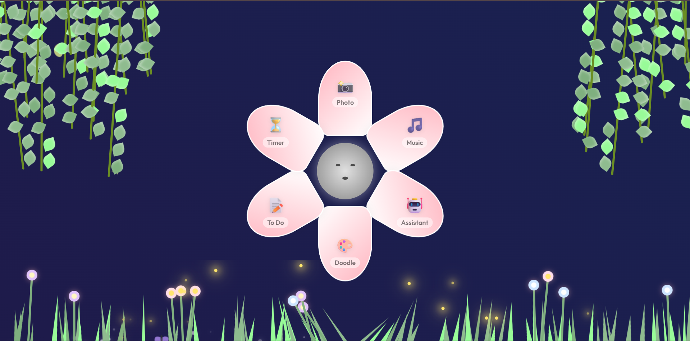
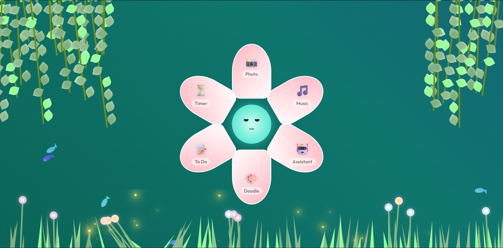

# 🌸 FunPetals - Productivity Web App

FunPetals is a visually engaging productivity web app designed with a flower-inspired interface. Each petal represents a feature to help users stay organized and focused.

## ✨ Features

* 📸 Photo capture
* ⏱ Timer for focus sessions
* 🎵 Music player
* 🤖 Assistant integration
* 📝 To-Do list
* 🎨 Doodle pad

## 🎯 Purpose

This project combines productivity tools into a single interactive UI to improve focus and user engagement.

## 🛠 Tech Stack

* HTML
* CSS
* JavaScript

## 📸 Preview

### 🎥 Demo

## 🚀 Live Demo

(Will be added after deployment)

## 👨‍💻 Author

Abhinav G
